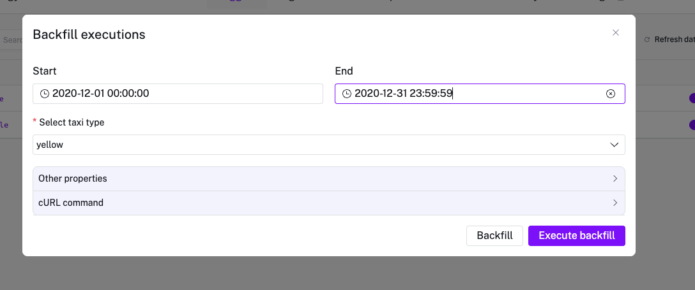
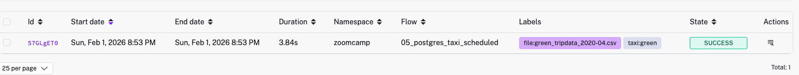

# Question 1

I run Backfill for Yellow Taxi data, StartDate = 2020-12-01 00:00:00 EndDate = 2020-12-31 23:59:59, then I check the size of the output .csv table

I also edited the extract task: 
  - id: extract
    type: io.kestra.plugin.scripts.shell.Commands
    outputFiles:
      - "*.csv"
    taskRunner:
      type: io.kestra.plugin.core.runner.Process
    commands:
      - wget -qO- https://github.com/DataTalksClub/nyc-tlc-data/releases/download/{{inputs.taxi}}/{{render(vars.file)}}.gz | gunzip > {{render(vars.file)}}
      - |
        echo "Downloaded file: {{render(vars.file)}}"
        echo "File size: $(du -h {{render(vars.file)}} | cut -f1)"
        echo "Line count: $(wc -l < {{render(vars.file)}})"

Answer: 129M (128.3 MiB is the closest answer)

# Question 2

I backfill green taxi data for dates 2020-04-01 - 20-04-30 and check the file variable in the execution:

Answer: green_tripdata_2020-04.csv

# Question 3
I executed the Backfill for Yellow taxi for year 2020, then I check the number of rows in Postgres:

SELECT COUNT(*) 
FROM public.yellow_tripdata
WHERE filename LIKE '%2020%';

Answer: 24,648,499

# Question 4
I executed the Backfill for Green taxi for year 2020, then I check the number of rows in Postgres:

SELECT COUNT(*) 
FROM public.green_tripdata
WHERE filename LIKE '%2020%';
Answer:1,734,051

# Question 5
I executed the Backfill for Yellow taxi for March 2021, then I check the number of rows in Postgres:

SELECT COUNT(*)
FROM public.yellow_tripdata
WHERE filename = 'yellow_tripdata_2021-03.csv';

Answer:1,925,152

# Question 6

triggers:
  - id: green_schedule
    type: io.kestra.plugin.core.trigger.Schedule
    cron: "0 9 1 * *"
    timezone: America/New_York
    inputs:
      taxi: green

  - id: yellow_schedule
    type: io.kestra.plugin.core.trigger.Schedule
    cron: "0 10 1 * *"
    timezone: America/New_York
    inputs:
      taxi: yellow

Answer:
Add a timezone property set to America/New_York in the Schedule trigger configuration
