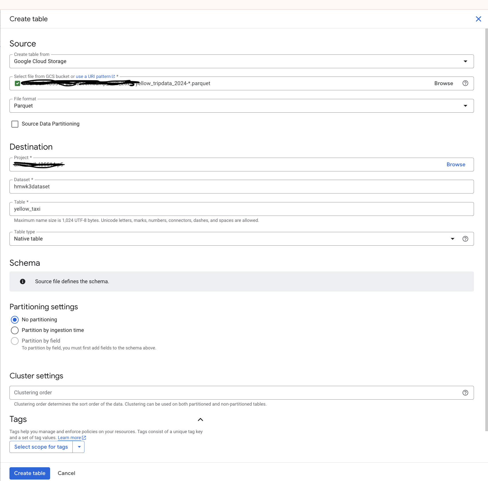

# Initial setup
I ran load_yellow_taxi_data.py script and created an external BigQuery table using loaded parquet files:

# Question 1

SELECT count(*) FROM `axial-trail-485514-p5.hmwk3dataset.yellow_taxi`

Answer: 20332093

# Question 2

select count(distinct PULocationID) as distinct_ids FROM `axial-trail-485514-p5.hmwk3dataset.yellow_taxi`;

155.12 MB

SELECT count(distinct PULocationID) as distinc_id_ext FROM `axial-trail-485514-p5.hmwk3dataset.yellow_taxi_external`;

0B

Answer: 
0 MB for the External Table and 155.12 MB for the Materialized Table

# Question 3

SELECT PULocationID FROM `axial-trail-485514-p5.hmwk3dataset.yellow_taxi`;
This query will process 155.12 MB when run.

SELECT PULocationID, DOLocationID FROM `axial-trail-485514-p5.hmwk3dataset.yellow_taxi`;
This query will process 310.24 MB when run.

Answer:
BigQuery is a columnar database, and it only scans the specific columns requested in the query. Querying two columns (PULocationID, DOLocationID) requires reading more data than querying one column (PULocationID), leading to a higher estimated number of bytes processed.

# Question 4
SELECT count(fare_amount) FROM `axial-trail-485514-p5.hmwk3dataset.yellow_taxi`
where fare_amount = 0;

Answer: 8333

# Question 5
CREATE OR REPLACE TABLE `axial-trail-485514-p5.hmwk3dataset.yellow_taxi_optimized`
PARTITION BY DATE(tpep_dropoff_datetime)
CLUSTER BY VendorID
AS
SELECT * FROM `axial-trail-485514-p5.hmwk3dataset.yellow_taxi`;

Answer: Partition by tpep_dropoff_datetime and Cluster on VendorID

# Question 6

SELECT distinct VendorID FROM `axial-trail-485514-p5.hmwk3dataset.yellow_taxi` where tpep_dropoff_datetime >= '2024-03-01' and tpep_dropoff_datetime <= '2024-03-15';
This query will process 310.24 MB when run.

SELECT distinct VendorID FROM `axial-trail-485514-p5.hmwk3dataset.yellow_taxi_optimized` where tpep_dropoff_datetime >= '2024-03-01' and tpep_dropoff_datetime <= '2024-03-15';
This query will process 26.84 MB when run.

Answer: 
310.24 MB for non-partitioned table and 26.84 MB for the partitioned table

# Question 7
Answer: GCP Bucket

# Question 8
Clustering is not helpful for low-cardinality or rarely-used columns, it adds maintenance overhead for streamed/updated data;
Answer: No

# Question 9
SELECT count(*) FROM `axial-trail-485514-p5.hmwk3dataset.yellow_taxi`;
This query will process 0 B when run.

(BigQuery used a cached result for that identical query, it shows “0 B” to run — the engine will return the previous cached output instead of scanning the table again)